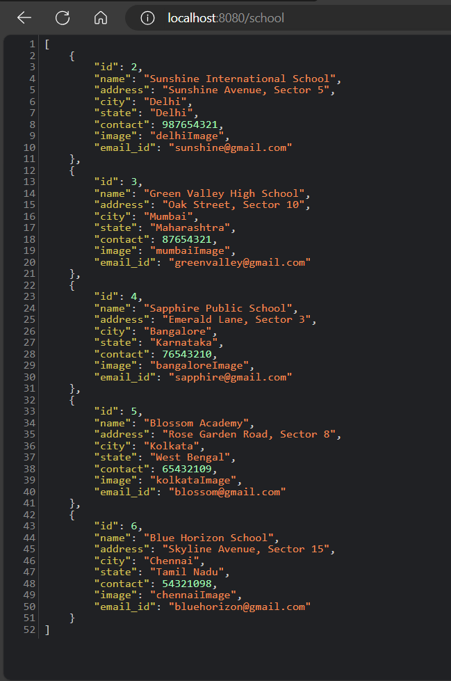
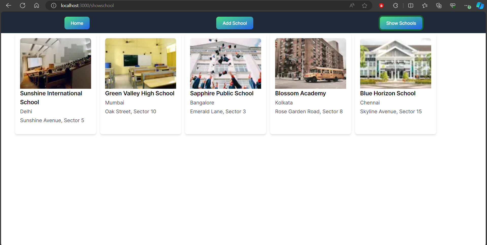
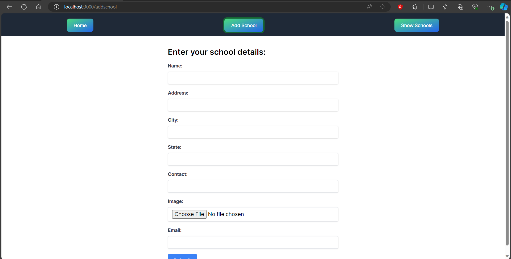

# School App

This application allows you to post data to the backend and display it on the page.

## Features
- Tailwind CSS for styling
- Next.js for server-side rendering
- React hooks form for managing state
- Form handling with React Hook Form
- MySQL for backend database

## Installation
To run this project locally, follow these steps:

1. Clone the repository to your local machine:
   ```bash
   git clone <repository-url>


## ScreenShot




